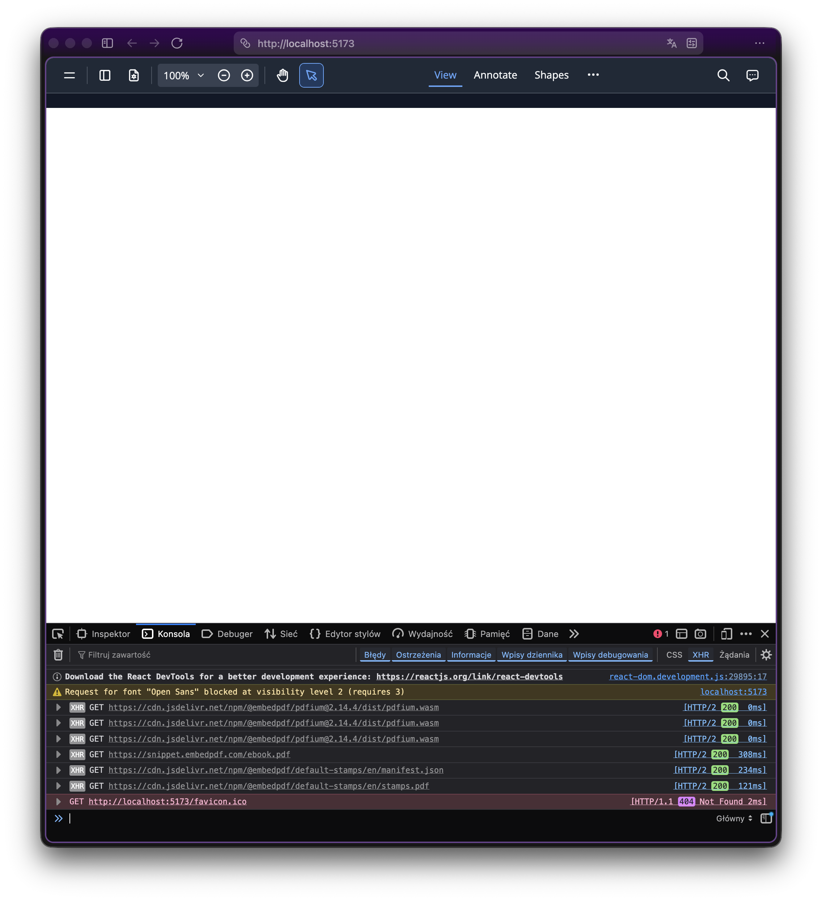
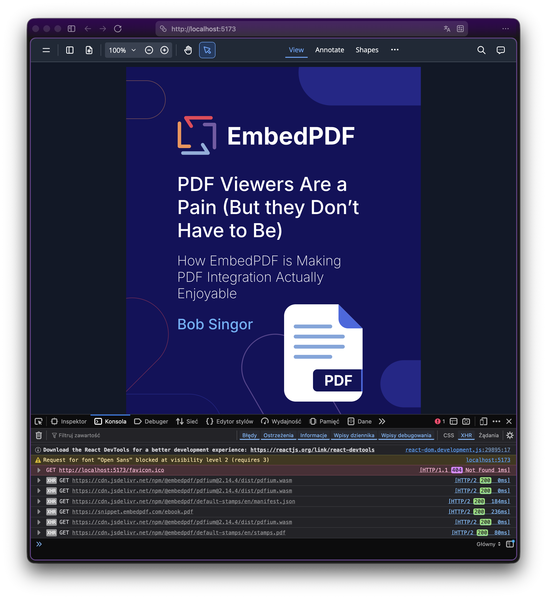

# Testing the EmbedPDF React PDF Viewer

## Purpose

This project demonstrates a zoom-related issue and provides a workaround for the
EmbedPDF React PDF Viewer component in a React application.

## Environment

- [React](https://react.dev/) `18.3.1`
- [Vite](https://vite.dev/) `7.3.2`
- [EmbedPDF React PDF Viewer](https://www.embedpdf.com/react-pdf-viewer)
  `2.14.4` (latest and stable at the time of writing
  this README)

## Installation

```shell
pnpm install
```

## Run the project

```shell
pnpm start
```

## The issue and a workaround

| Issue (the "before")                                                                                                       | Workaround applied (the "after")                                   |
|----------------------------------------------------------------------------------------------------------------------------|--------------------------------------------------------------------|
| When page is loaded, the PDF is not visible to the user until they change zoom level (e.g., by clicking the zoom buttons). | When page is loaded, the PDF is visible                            |
|                                                             |  |

### Workaround (the "after")

```js
// src/App.jsx:15

docManager.onDocumentOpened((doc) => {
  setTimeout(function () {
    zoom.requestZoom(1); // it works
  }, 100);
});
```

See more in the [src/App.jsx](src/App.jsx) file.
